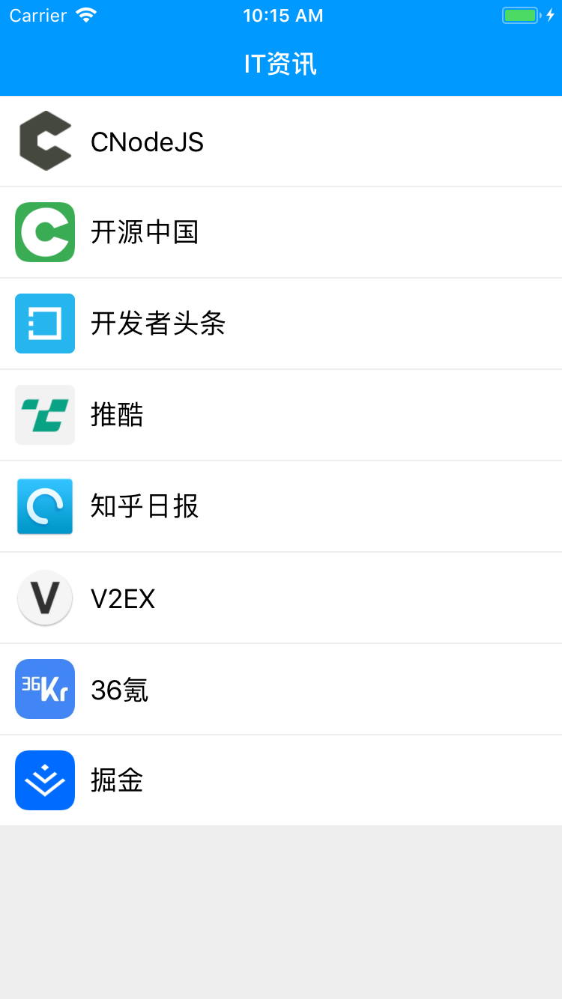

# ITNews

IT资讯APP，使用React Native编写

功能非常简单: 列表（listview）+ 详情（webview）+ 分享功能

## 使用到的组件

- react-navigation StackNavigator
- react-native-webview2
- react-native-vector-icons
- cheerio-without-node-native

## 开始

- clone 本项目
- 安装package `yarn install`
- 运行 `react-native link` 把字体安装到ios/android里去
- 运行在模拟器里 `react-native run-ios` or `react-native run-android` （其中run-android要保证电脑上启动了一个Android模拟器，或者手机连接到电脑上了）

**注意：安卓运行要在android文件夹下创建一个local.properties文件，里面写上`sdk.dir=your android path`**

## 下载

没法打IOS的包，只提供了Android下的包，可以去 [Release](https://github.com/tomoya92/ITNews-React-Native/releases) 里去下载最新的APK

- 推荐自己打包，`cd android & ./gradlew assembleRelease` 因为有时候更新了代码不能保证能及时打包
- IOS用户可以使用XCODE打开 `ios/ITNews.xcodeproj` 文件，直接运行到自己的手机上就可以了

**注意：Android打包之前要在 `~/.gradle` 下新建一个 `gradle.properties` 文件，里面配置一下证书信息**

```properties
MYAPP_RELEASE_STORE_FILE=your store file path
MYAPP_RELEASE_KEY_ALIAS=your alias
MYAPP_RELEASE_STORE_PASSWORD=your store password
MYAPP_RELEASE_KEY_PASSWORD=your password
```

## 截图

<div style="display: flex; flex-direction: 'row'; justify-content: 'space-between'">
  
  
  
</div>

## 开源协议

MIT
